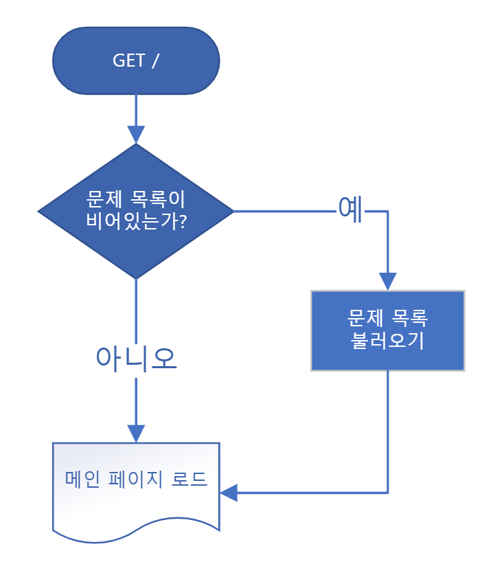
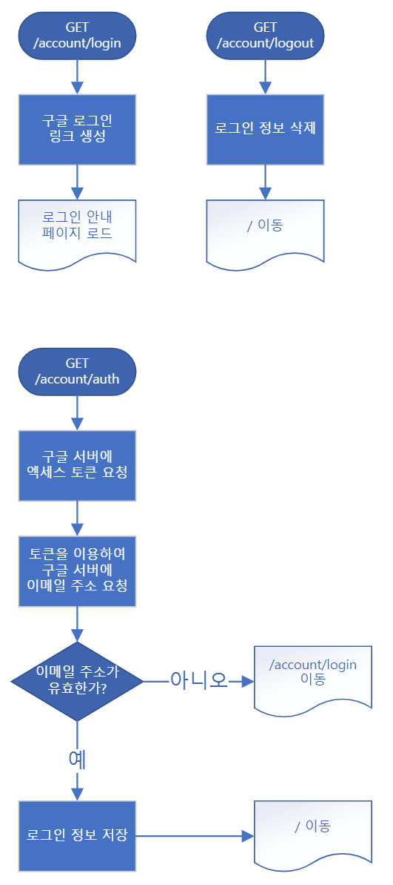

# python-trainer

* README는 아직 작성중입니다.
* 설치 방법: [CONTRIBUTING.md](CONTRIBUTING.md)

## 차례

## 1. 프로젝트 동기

 고등학교 1학년 정보 시간에, 많은 학생들이 학교에서 처음으로 파이썬 프로그래밍을 접하게 된다. 대부분이 코딩을 처음 접해보는 만큼, 파이썬 사용법을 익히는 것을 어려워하는 학생들이 많다.
 
 따라서 학생들이 파이썬 프로그래밍을 연습할 수 있는 온라인 저지(Online Judge) 사이트를 개발하였다. 프로그래밍을 연습할 수 있는 저지 사이트는 많지만, 학교 내의 친구들과 랭킹 시스템을 이용하여 경쟁적 요소와 함꼐 수업 시간에 배운 내용을 이용하여 학습할 수 있는 플렛폼을 개발하고자 하였다.

## 2. 이론적 배경

### 온라인 저지
 온라인 저지(Online Judge)란 프로그래밍 대회에서 프로그램들을 시험할 목적으로 만들어진 온라인 시스템이다. 대회 연습용으로 사용되기도 한다.

 시스템은 코드를 컴파일하여 실행하고, 미리 작성된 데이터로 테스트를 가동한다. 제출된 코드는 시간, 메모리, 보안 등에 관한 제한을 받을 수 있다. 시스템은 출력 데이터를 받아 표준 출력과 비교한 뒤, 결과를 내어 준다. [참고10]

 2015 개정 교육과정의 정보 교육에서는 '문제해결과 프로그래밍' 영역이 확대되어, 학습자의 흥미와 동기를 유발할 수 있는 문제를 제시하고, 문제를 해결하는 여러 프로그램을 알고리즘 수행 시간 관점에서 분석하여, 학습자가 작성한 프로그램의 정확성과 효율성을 평가하도록 권고하고 있다. 다만 많은 학생들이 작성한 프로그램의 알고리즘을 모두 평가하는 것은 매우 어려워, 온라인 저지와 같은 자동평가시스템의 활용이 대안으로 떠오르고 있다. [참고11]

 개발자들에게 주로 알려진 온라인 저지 사이트는 acmicpc.net, jungol.co.kr, www.dovelet.com 등이 있다. 교사들에 의해 운영된다고 알려진 온라인 저지 사이트의 선례로는 codeup.kr, koistudy.net, judgeon.net, codingfun.net 등이 있다.

### Docker
 Docker는 컨테이너 기술을 활용하는 앱의 개발, 제공 및 실행을 위해 설계된 소프트웨어 컨테이너 플렛폼이다. 컨테이너 기술이란, '사용자 공간'을 추상화하여 경량의 운영체제 수준의 가상화를 제공하는 것으로, 하드웨어 단계에서 가상 환경을 제공하는 VM(Virtual Machine)보다 빠르고 안정적으로 실행될 수 있게 해주는 표준 소프트웨어 장치이다. 컨테이너는 영구적이지 않으며 미리 생성해둔 이미지를 기반으로 가상 환경을 생성한다.

 이미지를 기반으로 가상 환경을 빠르게 구축하기에 동일한 실행 환경을 짧은 시간 내에 구축할 수 있다는 것이 특징이다. 이미지에는 

## 3. 기능 설계

### 3-1. 기존 사이트와의 차이점
일반인을 상대로 공개된 사이트들의 경우, 다음과 같은 문제점들을 찾을 수 있었다.

- 문제가 너무 많아 수준에 맞는 문제를 찾기 어려웠던 점
- 학교 진도와 맞지 않는 내용이 나와도 이를 모르고 헤맬 수 있음
- 사용하지 않는 기능이 많아 혼란스러울 수 있음
- 대회 기능을 사용할 경우, 대회 내용이 외부에 공개됨

교사들이 운영하는 사이트들의 경우, 다음과 같은 문제점들을 찾을 수 있었다.

- 대부분의 사이트가 일시적으로 운영되어 현재는 사용할 수 없다는 점
- 대부분 강좌가 해당 교사가 지정한 학생들만 수강 가능하여, 외부인은 수강이 어렵다는 점
- 자체 로그인 시스템만을 갖고 있어 보안 상 취약점이 존재할 수 있다는 점
- 이미 만들어진 오픈소스 시스템을 가져와 구동하는 경우가 많은데, 많은 사이트에서 사용하는 시스템이 중국(해외) 프로그램이라는 점 [참고12]
- 기능이 없거나 설명이 빈약하여 원하는 기능을 바로 찾아서 사용할 수 없다는 점

따라서 이 프로젝트에서는 다음 부분에 주력하였다.
- 학교 진도에 맞춰서 문제가 구성됨
- 난이도별로 나눠 

// @TODO: 학생 프로필 페이지, 레이아웃 표로 변경

### 3-2. 기능 설계

- 홈
  - 사이트 제목 및 설명 문구
  - 이용 가이드 (링크로 대체)
  - 단계별, 수준별 문제 목록
- 문제
  - 문제 내용
  - 입력 및 출력 설명
  - 입력 및 출력 예제
  - 참고 설명
  - 코드 작성 화면 (에디터)
  - 테스트케이스 입력값 설정 및 제출
- 제출
  - 모든 제출 목록
  - 테스트/제출 결과 상세 보기
  - 제출한 코드 실행 및 채점
  - 실시간 진행률 안내
- 계정
  - 사용자 목록 및 랭킹
  - 사용자 정보 상세보기
  - 로그인

## 4. 구조 설계

### 4-1. 사이트 구조
* `/` 메인
* `/problem/<int>` 문제
* `/submit` 제출 목록
* `/submit/<int>` 제출 상세보기
* `/account` 사용자 목록 (랭킹)
* `/account/login` 로그인
* `/account/logout` 로그아웃

### 4-2. DB 구조
#### 사용자 계정
|이름|설명|타입|비고|
|-|-|-|-|
|id|사용자 고유 ID (학번)|unsigned int|수정 불가|
|score|총 점수|unsigned int|0|
|submits|각 문제의 마지막 제출, 획득 점수, 타인 코드 열람 유무 기록|JSON Dict||
|permissions|사용자의 문제 열람용 권한 목록|JSON List||

#### 제출 목록
|이름|설명|타입|비고|
|-|-|-|-|
|type|제출 종류|SubmitType|수정 불가|
|code|제출한 코드|string|수정 불가|
|result|실행/채점 결과|ResultType|3글자 제한|
|time_usage|실행 시간 (ms)|unsigned int|nullable|
|memory_usage|사용한 메모리 (kb)|unsigned int|nullable|
|submit_time|제출한 시간 (서버 기준)|unsigned int|수정 불가|
|code_length|코드 길이 (=`len(code)`)|unsigned int|수정 불가|
|problem_id|제출한 문제 번호(ID)|unsigned int|수정 불가|
|user_id|제출한 사용자 ID|unsigned int|수정 불가|
|stdin|`Test` 타입의 제출에서 지정된 입력. 또는 `Grade` 타입에서 틀리거나 오류가 발생한 경우의 입력값.|string|1024자 제한, nullable|
|stdout|`Test` 타입의 제출에서 실행 결과 출력값. 또는 `Grade` 타입에서 틀리거나 오류가 발생한 경우의 출력값. (오류가 발생하기 직전까지의 출력)|string|nullable, `출력 초과` 결과가 있기에 제한 없음|
|stderr|실행 중 오류가 발생했을 때, 오류 정보 (형식은 아래 참고)|JSON Dict|nullable|
|last_cast_idx|`Grade` 타입에서 틀리거나 오류가 발생한 경우의 테스트케이스 번호|unsigned int|nullable|
|score|이 제출에서 획득한 점수|int|unsigned int로 변경 예정|

##### SubmitType
|Enum|Code|설명|
|-|-|-|
|TEST|`T`|테스트 실행|
|Grade|`G`|코드 채점|

##### ResultType
|Enum|Code|실행 결과|SubmitType|
|-|-|-|-|
|ACCEPTED|`AC`|✅ 맞았습니다!!|`Grade`|
|WRONG_ANSWER|`WA`|❌ 틀렸습니다|`Grade`|
|COMPLETE|`CP`|✅ 실행 완료|`Test`|
||||
|TIME_LIMIT|`TLE`|⏳ 시간 초과||
|MEMORY_LIMIT|`MLE`|💣 메모리 초과||
|OUTPUT_LIMIT|`OLE`|📝 출력 초과||
||||
|RUNTIME_ERROR|`RTE`|💥 오류 발생||
||||
|PREPARE|`PRE`|🚩 준비 중||
|ONGOING|`ON`|🔁 채점 중||
||||
|INTERNAL_ERROR|`IE`|⚠️내부 오류||

## 5. 구현 방식

### 5-1. 언어 및 프레임워크
- JavaScript(프론트엔드 프로그래밍 언어): 모든 브라우저에서 지원하는 JavaScript 언어를 사용하였습니다.
- Python(백엔드 프로그래밍 언어): 단기간의 빠른 개발을 위해, 관련 자료가 풍부하고 높은 생산성을 자랑하는 Python 언어를 사용하였습니다. [참고8]
- Django(백엔드 프레임워크): 빠른 개발과 안전한 웹 프레임워크로 알려져 있고, 교내 공학동아리 로델라에서도 자주 이용하는 Django 프레임워크를 사용하였습니다. [참고9]
- SQLite3: Python에서 

### 5-5. 배포 및 웹서버 구동
 서울특별시교육청에서는 관내 학교의 교사 및 학생들에게 Office 365(현 Microsoft 365) 계정을 제공하고 있습니다.[참고1] 학생 정보를 인증하고 동록하면 Office 계정을 제공받는데, 이 계정은 소속 학교의 도메인(@학교.sen.go.kr)을 사용합니다. 또한 Microsoft사의 클라우드 서비스인 Azure[참고2]에서는 학생들에게 교육적 목적으로 1년간 사용 가능한 $100 크레딧(해당 제품에서 실제 재화 대신 사용할 수 있는 가상 재화)을 무료로 제공합니다.[참고3] 학교 도메인을 이메일 주소로 사용하는 Microsoft 계정을 사용함으로써 이러한 교육적 혜택을 누릴 수 있는데, 이 계정은 위의 서울특별시교육청에서 제공해 주는 Office 365 계정으로 대체 가능합니다. 이러한 혜택을 통해 금전적 부담 없이 웹 서버를 구축할 수 있습니다.

 위 혜택을 통해 Azure 서비스에서 가상 환경을 대여하여 사용하고 있습니다. 서버 사양은 B2ms(가상 CPU 코어 2개, 메모리 8GB)이며, 운영체제는 Ubuntu 20.04, Python 3.8.10을 사용합니다.

 웹 주소는 freenom.com에서 무료로 발급 가능한 도메인 중, Python의 앞 두글자 py를 따와 pypy.ga 도메인을 사용했습니다. DNS 서버는 Azure DNS 영역을 사용합니다.

### 5-4. 계정 시스템
 로그인에는 학교에서 제공해 준 Google 계정(@sonline20.sen.go.kr) 을 사용합니다. 유저는 로그인 버튼을 눌러 구글 로그인 창으로 넘어가게 되고, 로그인이 완료되면 구글 서버에서 이메일 주소를 서버로 받아와 도메인이 학교 계정의 도메인(@sonline20.sen.go.kr) 이 맞는지 확인합니다. 확인이 완료되면 해당 세션에 대해 유저 정보가 입력되며 로그인이 완료됩니다.

## 6. 구현 방식
### 1) `index/` - 메인 페이지
* `/` - 문제 목록을 로드합니다. 문제 목록이 비어있다면, 문제 목록을 새로 불러옵니다.

### 2) `account/` - 계정 페이지
* `/account/login` - 구글 로그인 링크를 생성하고, 안내 페이지를 로드합니다.
* `/account/logout` - 로그인 정보를 삭제하고, 메인 화면으로 이동합니다.
* `/account/auth` - 로그인 완료 후 이동되는 페이지로, 구글 서버로 요청을 보내 엑세스 토큰을 요청하고, 해당 토큰을 이용하여 이메일 주소를 받아옵니다. 이메일 주소가 유효하다면 로그인 정보를 저장하고 메인 화면으로 이동하며, 유효하지 않다면 로그인 안내 페이지로 이동합니다.

### 3) `problem/` - 문제 페이지
* `/problem/<int>` - 해당하는 문제와 코드 에디터 화면을 표시합니다. 이전에 해당 문제에서 제출한 기록이 있다면 해당 제출의 코드를 불러옵니다.

## 참고 문헌

1. https://o365.sen.go.kr/
2. https://azure.microsoft.com/ko-kr/resources/cloud-computing-dictionary/what-is-azure/
3. https://azure.microsoft.com/ko-kr/free/students/
4. https://azure.microsoft.com/ko-kr/services/app-service/
5. https://github.com/about
6. https://docs.github.com/en/actions
7. https://www.djangoproject.com/
8. https://library.gabia.com/contents/9256/
9. https://developer.mozilla.org/en-US/docs/Learn/Server-side/Django/Introduction
10. https://ko.wikipedia.org/wiki/온라인_저지
11. 프로그래밍 교육에서 온라인 저지 시스템의 활용이 학습동기와 사고력에 미치는 영향 : 변인 간 구조적 관계 규명, 장원영, 2021 https://www.kci.go.kr/kciportal/ci/sereArticleSearch/ciSereArtiView.kci?sereArticleSearchBean.artiId=ART002757313
12. https://github.com/QingdaoU/OnlineJudge
